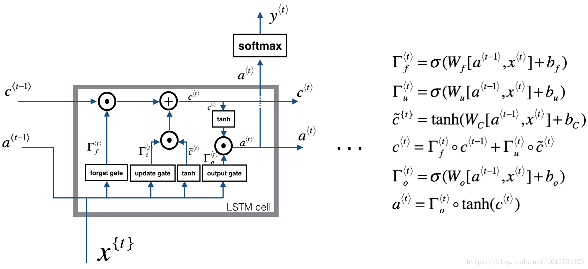
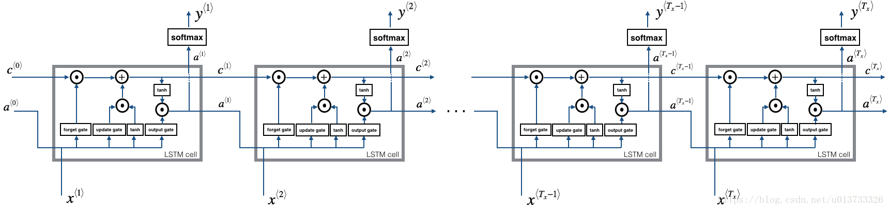
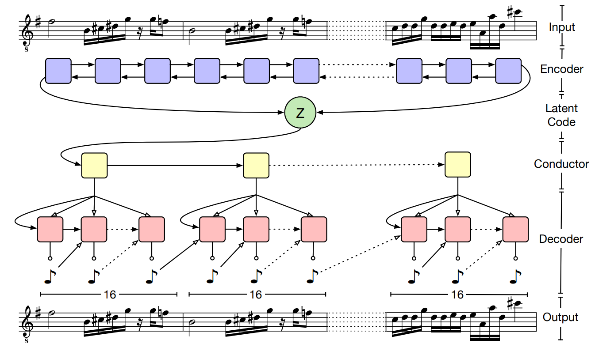

备注：先md糊一下，之后我用latex排排好，大家可在后面直接接着写，也可以另开新的，到时候我一起整合。

## 1、实验目的和背景

很久之前，莫扎特曾经创作过一首《骰子音乐》，通过丢骰子的方法自动选择小节组合，组合出来的完整音乐仍然悦耳，但是创作的过程带有一定的随机性。 1950年代计算机发明后，出现了第一批计算机音乐。最早的音乐构建了一个马尔科夫过程，使用随机模型进行生成，辅以rule-based的方法挑选符合要求的结果。

而现在随着机器学习的发展，算法能从原始的音乐数据中自动地学习出一些规律，从而生成符合人们听觉习惯和审美感受的音乐。 NVIDIA的AIVA模型、 Google Magenta的MusicVAE模型、 OpenAI的Jukebo模型都是AI作曲领域中的佼佼者。

在音乐制作这个实验中，小组希望可以通过使用深度学习某些技巧和框架，让更多的人即使不了解任何音乐理论，都能创作出属于自己的原创音乐 。用深度学习的方法降低音乐制作的门槛，并通过趣味性的可视化，让更多的人感受音乐的魅力。基于这个目标，项目需要完成以下要求：

* 用户只需要调整少量参数完成音乐制作
* 通过神经网络自动生成音乐，保证音乐的艺术性和独特性
* 设计音游，将生成的音乐进行必要的可视化，实现交互性和趣味性
* 基于Web端构建，跨平台支持

## 2、功能设计

### 2.1 总体功能设计

项目分为两个主要的模块，分别是**音乐生成**模块和**音乐游戏**模块。在音乐生成模块，用户可以调整参数，生成独一无二且符合人类听觉习惯的音乐。在音乐游戏模块，我们根据之前用户制作的音乐生成地图，用户可以通过上下左右键完成跑酷游戏，打造专属音游。

### 2.2 各模块界面

2.2.1 音乐生成

（图片）

2.2.2 音游界面

（图片）

## 3、项目原理

### 3.1 MIDI格式解析与原理

在音乐生成模块中，MusicVAE是基于MIDI格式对音乐进行训练、生成的，然后将生成MIDI格式导出为JSON格式交由音游模块生成相应的地图。

MIDI(Musical Instrument Digital Interface)是数字音乐国际的标准，定义了计算机音乐程序、合成器及其他电子设备交换信息和电子信号的方式，解决不同电子乐器之间不兼容的问题。MIDI文件中包含音符、定时和多达16个通道的演奏定义。文件包括每个通道的演奏音符信息：键通道号、音长、音量和力度等。 

（具体的格式解析沛瑶补充一下？）

### 3.2 MusicVAE原理

本次音乐制作大作业中小组在音乐生成模块中使用了Google Magenta的MusicVAE模型。Magenta是由Google Brain发起的旨在利用机器学习进行艺术创作的一个项目，而MusicVAE是Magenta的一个子项目，是一种用于学习乐谱隐空间的分层递归变化自动编码器。 为了便于利用MusicVAE构建工具，小组使用了Google发布的相关js库，并阅读论文《A Hierarchical Latent Vector Model for Learning Long-Term Structure in Music》学习了原理。 

#### 3.2.1 隐空间模型（latent space models）

隐空间模型的技术目标是将高维数据通过低维编码呈现出来，使得人们对于数据的直觉特点能够被容易的探索和操控，而音乐序列本质上也是具有高维特性的。以钢琴为例，任意一时刻88个键都有可能处于按下或者释放的状态，或者演奏者在休息。那么一共就有九十种可能（88键，1释放，1休息），如果记录下两小节4/4拍的16分音符就会出现$90^{32}$中可能的序列，远远超出计算能力。 所以我们需要使用隐空间技术将音乐序列转化为低维编码。在这个过程中我们可以学习到训练序列中的基本特征并排除非常规的随机序列，同时还能在低维空间中表示真实数据的变化，这意味着模型可以以很高的精度重建真实样本。此外，当在压缩数据集空间时，隐空间模型将会趋向于利用基本特征来组织，将类似的样本聚合在一起并按照定义它们特征的方差来进行排列。 

**隐藏空间模型的特点可以总结为以下3点：**

- 压缩表达：任何真实的样本都可以被映射到隐含空间中，并从中重建；
- 真实性：隐含空间中的任何点都代表着真实空间中的数据，即使数据不在训练集中；
- 平滑性：在隐含空间中邻近的样本具有相似的特性。

目前有很多模型可以学习到隐藏空间的表示，自动编码器就是其中的一种。它可以学习将每一个输入样本压缩为一个数值矢量（ latent code ），随后又基于 latent code 重建出相同的样本。自编码器的关键在于生成出比数据维度更小的矢量来表述数据。同时在这个过程中，自编码器会提取数据集中的特性。 

  

#### 3.2.2 LSTM循环神经网络

长短期记忆（Long short-term memory, LSTM）是一种特殊的RNN，主要是为了解决长序列训练过程中的梯度消失和梯度爆炸问题。相比普通的RNN，LSTM通过门控状态来控制传输状态，记住需要长时间记忆的，忘记不重要的信息，因而能够在更长的序列中有更好的表现。

  

LSTM单元如上图所示， 与普通的RNN只传递状态$a^{\langle t \rangle}$相比，它跟踪与更新每个时间步上的记忆变量$c^{\langle t \rangle}$ 以及隐藏状态$a^{\langle t \rangle}$，来记住一些长序列中的结构信息。根据 LSTM的当前输入$x^{\langle t \rangle}$和上一个状态传递下来的$a^{\langle t-1 \rangle}$拼接训练得到三个状态 ：
$$
遗忘门：Γ_f^{\langle t \rangle} = σ(W_f[ a^{\langle t-1 \rangle}, x^{\langle t \rangle}]+b_f )\\
更新门：Γ_u^{\langle t \rangle} = σ(W_u[ a^{\langle t-1 \rangle}, x^{\langle t \rangle}]+b_u )\\
输出门：Γ_o^{\langle t \rangle} = σ(W_o[ a^{\langle t-1 \rangle}, x^{\langle t \rangle}]+b_o )\\
$$
 其中，$Γ_f^{\langle t \rangle}$、$Γ_u^{\langle t \rangle}$、$Γ_o^{\langle t \rangle}$是由拼接向量乘以权重矩阵之后，再通过一个$sigmoid$激活函数转换成0到1之间的数值，来作为一种门控状态。 

LSTM内部主要有三个阶段：

* 忘记阶段：对上一个节点传进来的输入进行选择性忘记。通过计算得到的$Γ_f^{\langle t \rangle}$来作为忘记门控，来控制上一个状态的 $c^{\langle t-1\rangle}$哪些需要留哪些需要忘。 因此将这个遗忘门向量$Γ_f^{\langle t \rangle}$将与前一个单元状态相乘， $c^{\langle t-1\rangle}$因此，如果的$Γ_f^{\langle t \rangle}$一个值是等于0（或者 $\approx 0$），则意味着LSTM应该删除对应的信息，如果其中有=1的值，那么LSTM将保留该信息。 

* 更新阶段： 一旦我们忘记了之前的信息，就需要找到一种方法来更新它。与遗忘门相似，$\Gamma_u^{\langle t \rangle}$向量的值是在0-1之间，为了计算$c^{\langle t \rangle}$，它会与$\tilde c^{\langle t \rangle}$相乘。 $\tilde c^{\langle t \rangle}$是我们新创建的向量 ，它的计算公式为：
  $$
  \tilde c^{\langle t \rangle}= tanh(W_C[ a^{\langle t-1 \rangle}, x^{\langle t \rangle}]+b_C )\\
  $$
  于是我们可以得到综合遗忘和更新得到的最后的更新公式：
  $$
  c^{\langle t \rangle} = \Gamma_f^{\langle t \rangle}\ast c^{\langle t - 1 \rangle} + \Gamma_u^{\langle t \rangle} \ast \tilde c^{\langle t \rangle}
  $$

* 输出阶段：这个阶段将决定哪些将会被当成当前状态的输出。主要是通过$Γ_o^{\langle t \rangle}$来进行控制的。并且还对上一阶段得到的$c^{\langle t \rangle}$进行了放缩（通过一个tanh激活函数进行变化）。  

将上述LSTM单元循环调用，就可以实现不断由当前状态预测下一状态的功能，从而生成有上下文以来的长序列，结构如下图所示。

#### 3.2.3 模型整体结构

VAE是一种被广泛使用的生成模型，对于音乐这种序列数据同样可以用VAE生成，最直接的做法就是使用RNN将音乐编码为latent code，再用RNN将latent code解码为音乐。但是这种朴素的RNN存在缺点，对于长序列的音乐生成往往到一定时间节点之后就会“遗忘”latent code，局限在生成的局部信息中，导致出现“posterior collapse”的情况，即生成的结果基本与latent code无关。所以MusicVAE采用层次化的设计就显得尤为巧妙了，给每一小节分配一个新的向量，防止latent code消失。

**网络结构：Bidirectional Encoder + conductor RNN + Hierarchical Decoder**

- Bidirectional Encoder：这里用了一个两层的B-LSTM来进行编码，latent code是用正序逆序两个方向的hidden state的连接结果计算的
-  conductor RNN：在网络中增加了conductor RNN（两层单向LSTM）来生成新的输出小节，代替了原来直接利用latent code 初始化音符RNN解码器。 
- Hierarchical Decoder：朴素的RNN decoder会出现posterior collapse的情况，因此为了保证解码过程中始终利用latent code的信息，对解码器进行了层次化的设计。

层次的划分是基于音乐本身的结构特点：一首音乐包括$U$个小节，每个小节又包括$T$个节拍。基于这样的观察，latent code首先通过一个conductor RNN被映射为$U$个vector，这些vector就被用来初始化最终的Decoder RNN。在decode阶段，每$T$次RNN的隐藏状态就被初始化为下一个vector，对应了不同小节的音乐生成。在这样的设计之下，decoder RNN能通过这些vector来获取长程依赖，即一直都在利用latent code的信息。

### 3.3 快速傅里叶变换

（这个确定要用了我再写）